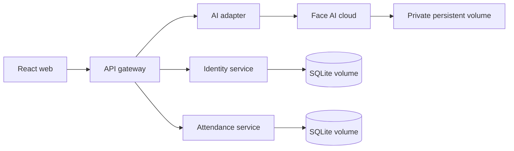

# SPAS microservices

External clients call only the gateway. Identity owns users/roles; attendance owns courses, sections and attendance records; the AI adapter owns the cloud-AI contract. Face images and embeddings never enter the TypeScript databases.

The current MVP uses separate SQLite Docker volumes so a member can run it with one command. A production deployment should replace those volumes with managed PostgreSQL. The Face AI gallery is stored in a private Docker volume; it is not application-encrypted, so protect the cloud disk and backups with platform encryption and access control.
