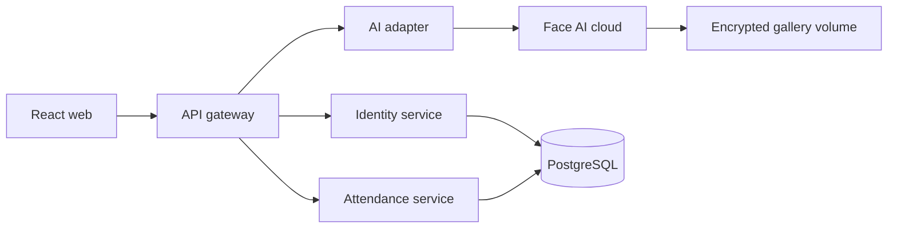

# SPAS microservices

External clients call only the gateway. Identity owns users/roles; attendance owns courses, sections and attendance records; the AI adapter owns the cloud-AI contract. Face images and embeddings never enter the TypeScript databases.
