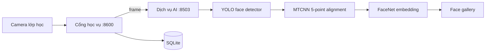

# SPAS — Smart Passive Attendance System

Hệ thống điểm danh lớp học qua camera, gồm cổng học vụ và dịch vụ AI nhận diện khuôn mặt. Đây là bản demo phục vụ đồ án: phát hiện khuôn mặt, căn chỉnh theo landmark, nhận diện bằng embedding FaceNet và đăng ký khuôn mặt có hướng dẫn tư thế.

## Chức năng chính

- Cổng sinh viên, giáo viên và quản trị: thời khóa biểu, lớp học, trạng thái điểm danh và quản lý sinh viên.
- Đăng ký khuôn mặt theo 4 tư thế ổn định: `thẳng → trái → phải → thẳng`.
- Phát hiện nhiều khuôn mặt bằng YOLO, căn chỉnh bằng MTCNN landmark và nhận diện bằng FaceNet 512-D.
- Camera điểm danh thời gian thực, ghi nhận sinh viên được nhận diện vào hệ thống.
- Quản trị viên xem thông tin sinh viên, ảnh đã đăng ký và đặt lại đăng ký khuôn mặt.

## Kiến trúc



## Cấu trúc repository

```text
management_app/                        Cổng học vụ và SQLite
ml_pipeline/demo_app/                  FastAPI inference/enrollment
ml_pipeline/kaggle_detector_kernel/    Notebook train YOLO detector trên Kaggle
ml_pipeline/kaggle_recognition_kernel/ Notebook fine-tune FaceNet trên Kaggle
ml_pipeline/src/                       Mã pipeline/train dùng lại
docs/                                  Báo cáo, EDA và quyết định mô hình
```

## Yêu cầu

- Windows/Linux, Python `3.11` khuyến nghị (Python `3.12` cũng đã dùng cho demo).
- Webcam để thử đăng ký/điểm danh; GPU CUDA là tùy chọn khi chạy inference cục bộ.
- Hai file trọng số do nhóm tự train: `face_best.pt` và `facenet_best.pt`.

## Cài đặt và chạy

Clone repository, sau đó mở **hai terminal** tại thư mục dự án.

### 1. Chuẩn bị trọng số AI

Không commit trọng số, gallery, ảnh đăng ký hoặc database lên GitHub. Tạo thư mục sau và chép hai file đã train vào đó:

```powershell
New-Item -ItemType Directory -Force ml_pipeline\demo_app\models
Copy-Item C:\duong-dan\face_best.pt ml_pipeline\demo_app\models\face_best.pt
Copy-Item C:\duong-dan\facenet_best.pt ml_pipeline\demo_app\models\facenet_best.pt
```

`face_best.pt` là YOLO detector; `facenet_best.pt` là mô hình FaceNet recognition. Nếu đặt ở vị trí khác, cấu hình biến `FACE_DETECTOR_PATH` và `FACE_RECOGNITION_PATH` trước khi chạy.

### 2. Chạy dịch vụ AI (terminal 1)

```powershell
cd ml_pipeline\demo_app
python -m venv .venv
.\.venv\Scripts\Activate.ps1
pip install -r requirements.txt
uvicorn server:app --host 127.0.0.1 --port 8503
```

Kiểm tra tại [http://127.0.0.1:8503/docs](http://127.0.0.1:8503/docs).

### 3. Chạy cổng học vụ (terminal 2)

```powershell
cd management_app
python -m venv .venv
.\.venv\Scripts\Activate.ps1
pip install -r requirements.txt
$env:SPAS_SESSION_SECRET = "thay-bang-chuoi-ngau-nhien-khi-deploy"
uvicorn app:app --host 127.0.0.1 --port 8600
```

Mở [http://127.0.0.1:8600](http://127.0.0.1:8600). Đảm bảo dịch vụ AI ở cổng `8503` chạy trước khi dùng đăng ký khuôn mặt hoặc quét điểm danh.

## Tài khoản demo

- Quản trị: `ADMIN001` / `admin123`
- Giáo viên: `GV001` / `gv123`
- Sinh viên: `SV001` / `sv123`

Đổi các tài khoản trên trước khi triển khai.

## Kiểm tra nhanh

```powershell
cd management_app
python self_check.py

cd ..\ml_pipeline\demo_app
python self_check.py
```

`management_app/self_check.py` thao tác dữ liệu test cục bộ trong `spas.db`; không chạy trên database triển khai thật.

## Train lại trên Kaggle

- `ml_pipeline/kaggle_detector_kernel/`: huấn luyện YOLO face detector với ảnh WIDER Face đã chuyển đổi nhãn YOLO.
- `ml_pipeline/kaggle_recognition_kernel/`: fine-tune FaceNet cho bài toán embedding/face gallery.
- Đầu ra cần đưa về demo là `face_best.pt` và `facenet_best.pt`; tạo lại gallery bằng luồng đăng ký khuôn mặt trên web.

Chi tiết dataset, tiền xử lý và kết quả có trong `docs/` và `ml_pipeline/README.md`.

## An toàn dữ liệu

`.gitignore` đã loại bỏ trọng số, database, ảnh enrollment và face gallery. Trước khi public repository, kiểm tra lại bằng `git status` để chắc chắn không có khóa API, dữ liệu khuôn mặt hay tài khoản thật trong staged files. Đổi tài khoản demo và `SPAS_SESSION_SECRET` trước khi triển khai.
