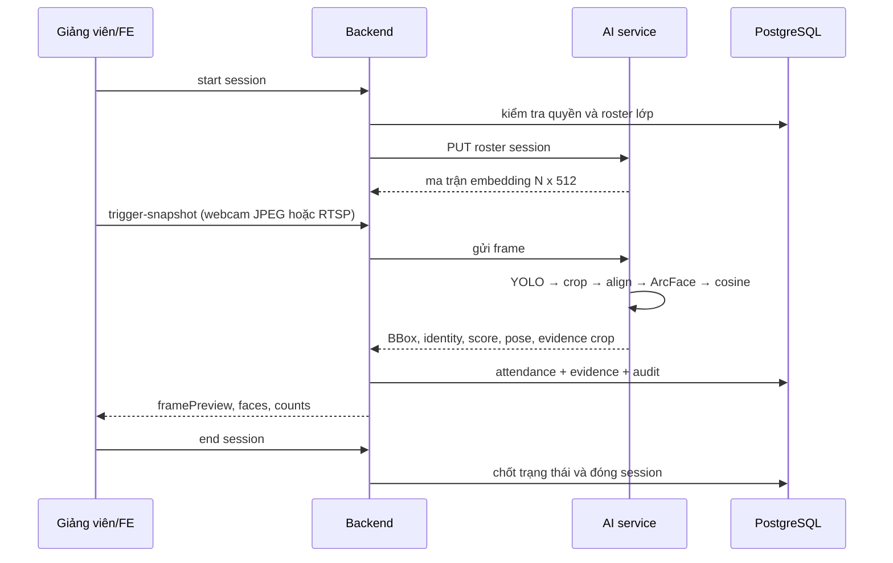

# Runbook demo AI và điểm danh SPAS

Tài liệu này dùng cho buổi demo 5–10 phút. Mục tiêu là cho thấy một luồng hoàn chỉnh từ camera → AI → Backend → giao diện → lịch sử điểm danh, không phải chứng minh hệ thống production cho hàng trăm phòng.

## 1. Kết quả cần trình bày

Sau buổi demo, người xem cần thấy được:

1. Sinh viên đăng ký khuôn mặt bằng webcam với hướng dẫn nhìn thẳng, quay trái, quay phải.
2. AI không nhận frame sai, không có mặt hoặc có nhiều mặt trong bước enrollment.
3. Giảng viên chọn lớp học phần và bật camera.
4. Một lần bấm **Điểm danh ngay** chạy trọn flow trong tối đa 1 phút.
5. YOLO vẽ BBox; ArcFace trả score; người thuộc roster được nhận diện.
6. Người ngoài roster hiện `UNKNOWN_PERSON`, không bị tự động ghi nhận là sinh viên của lớp.
7. Ảnh crop bằng chứng và trạng thái điểm danh xuất hiện trong hệ thống.
8. Sinh viên xem lại lịch sử, thời gian, lớp, ca học và ảnh bằng chứng.

Phạm vi hiện tại là **một camera, một session, demo bằng webcam trình duyệt hoặc RTSP**. Chưa nên giới thiệu đây là anti-spoof chuyên dụng, nhận diện 30 FPS liên tục hoặc hệ thống 100 phòng.

## 2. Chuẩn bị trước demo

### 2.1. Thư mục và container

Mở PowerShell tại:

```text
C:\Users\dangv\Desktop\SIC\SIC-Smart-Attendance
```

Kiểm tra model:

```text
models/face_best.pt
models/facenet_best.pt
```

Khởi động hệ thống:

```powershell
docker compose up -d --build
docker compose ps
```

Kiểm tra AI:

```powershell
curl http://127.0.0.1:8600/api/v1/health
```

Kết quả cần có HTTP `200`. AI service báo `detectorLoaded=true` và `recognizerLoaded=true` khi hai model đã được mount đúng.

### 2.2. Tài khoản seed QA

Đây là dữ liệu demo, không dùng cho production:

| Vai trò | Tài khoản | Mật khẩu |
|---|---|---|
| Admin | `ADMIN001` | `Admin@123` |
| Giảng viên | `GV001` | `Teacher@123` |
| Sinh viên đã có dữ liệu mẫu | `21020001` | `Student@123` |
| Sinh viên chưa enrollment | `21020002` | `Student@123` |
| Sinh viên chưa enrollment | `21020003` | `Student@123` |

Seed nằm tại `backend/src/scripts/seed.ts`. Nếu cần nạp lại dữ liệu QA, chạy script seed theo hướng dẫn trong `backend/README.md`; không xóa database thủ công trong lúc demo.

### 2.3. Camera

Có hai lựa chọn:

- **Webcam trình duyệt**: dùng camera của máy giảng viên/điện thoại. Phù hợp nhất cho demo.
- **RTSP**: chỉ dùng khi có stream RTSP thật và Backend/AI container truy cập được URL đó.

Khi dùng điện thoại hoặc truy cập từ máy khác, phải mở bằng HTTPS, ví dụ Cloudflare Tunnel. Quick Tunnel có thể đổi domain sau mỗi lần khởi động lại; dùng URL hiện đang được terminal Cloudflare in ra.

## 3. Luồng tổng thể của hệ thống



AI chỉ trả kết quả quan sát được: BBox, identity nếu match roster, score, pose, quality, evidence crop và frame preview. Quyết định `PRESENT`, `LATE`, `ABSENT`, `EXCUSED` thuộc Backend và phần hậu kiểm của giảng viên.

## 4. Demo enrollment sinh viên

### Bước 1 — Đăng nhập

1. Mở web tại `http://127.0.0.1:8600` hoặc domain tunnel.
2. Đăng nhập bằng tài khoản sinh viên chưa enrollment, ví dụ `21020002`.
3. Vào tab **Đăng ký khuôn mặt**.

Không dùng lại khuôn mặt đã được gắn với tài khoản khác. AI có cơ chế chống một khuôn mặt cho nhiều tài khoản và sẽ trả `409 Conflict` nếu phát hiện trùng.

### Bước 2 — Bật camera và tracking

1. Bấm **Bật camera** và cho phép trình duyệt truy cập camera.
2. Bấm **Bắt đầu tracking**.
3. Làm theo cue trên màn hình:
   - Nhìn thẳng vào camera.
   - Quay mặt sang trái.
   - Quay mặt sang phải.
   - Nhìn thẳng lần cuối.
4. Mỗi pose cần 2 frame hợp lệ; tổng thông thường là 8 frame.

FE lật ngang ảnh xem trước để thao tác trái/phải tự nhiên. Ảnh gửi lên Backend vẫn là ảnh đã capture theo đúng frame; AI kiểm tra số mặt, crop và pose.

### Bước 3 — Gửi xác thực

1. Khi progress đủ 8 frame, bấm **Gửi xác thực**.
2. Backend chuyển frames sang AI qua `/internal/v1/enrollments`.
3. AI tạo vector trung bình 512D, kiểm tra front/left/right và kiểm tra duplicate.
4. Backend lưu các ảnh gốc enrollment, biometric record và trạng thái `isFaceEnrolled`.
5. Camera được dừng sau khi thành công.

Nếu thấy `409`, đó là một trong hai trường hợp:

- Tài khoản hiện tại đã enrollment: cần admin reset rồi đăng ký lại.
- Khuôn mặt đã thuộc tài khoản khác: dùng khuôn mặt khác hoặc admin reset tài khoản cũ trước.

Frontend hiển thị lỗi ở toast và một hộp cảnh báo cố định ngay dưới nút gửi, nên không cần đoán qua Console.

## 5. Demo điểm danh bằng webcam

### Bước 1 — Mở lớp

1. Đăng nhập bằng `GV001 / Teacher@123`.
2. Vào danh sách lớp giảng dạy.
3. Chọn lớp có session mẫu, ví dụ `INT101-01`.
4. Nếu cần, dùng ô tìm kiếm để lọc theo mã môn hoặc lớp.
5. Kiểm tra phòng đang dùng **Webcam trình duyệt (Browser)** nếu không có RTSP.

Khi chọn lớp, mã session và mã ca học được lấy từ dữ liệu Backend; FE không tự đoán bằng một URL duy nhất.

### Bước 2 — Bắt đầu phiên

1. Bấm mở chi tiết session hoặc **Bắt đầu điểm danh**.
2. Bấm **Điểm danh ngay**.
3. Nếu session chưa live, FE gọi:

```http
POST /api/v1/teacher/sessions/{sessionId}/start
Authorization: Bearer <teacher-token>
```

Backend kiểm tra giảng viên có quyền với lớp rồi nạp roster của đúng lớp vào AI. Sinh viên ngoài roster không được đưa vào ma trận so khớp của session đó.

### Bước 3 — Cho phép camera

Khi phòng dùng webcam:

1. Cho phép trình duyệt sử dụng camera.
2. Video hiển thị realtime trên trang giảng viên.
3. FE lấy frame từ video, lật ngang và gửi một JPEG khi request trước đã hoàn tất.

Một lần bấm chạy cửa sổ quét tối đa 1 phút; không chờ 15 phút thật. Vòng lặp dừng sớm khi đủ sinh viên đã nhận diện hoặc hết thời gian demo.

### Bước 4 — Quan sát kết quả

Request webcam:

```http
POST /api/v1/teacher/sessions/{sessionId}/trigger-snapshot
Authorization: Bearer <teacher-token>
Content-Type: multipart/form-data

image=<attendance-webcam.jpg>
```

AI xử lý:

```text
frame
  → YOLO face detector
  → crop khuôn mặt
  → căn landmark và resize 160x160
  → InceptionResnetV1 tạo vector 512D
  → cosine với roster của session
```

Trên giao diện cần chỉ cho GV xem:

- BBox xanh: `MATCHED`.
- BBox đỏ: `UNKNOWN_PERSON` hoặc `AMBIGUOUS`.
- Mã/tên sinh viên, score và số người đã nhận diện.
- Danh sách người lạ cùng ảnh crop evidence.
- Frame camera hiện tại.

Người ở lớp khác, GV lọt vào khung hình hoặc người ngoài danh sách lớp phải hiện `UNKNOWN_PERSON`; không được tự động ghi nhận thành sinh viên lớp đang học.

### Bước 5 — Chốt lần điểm danh

Trong demo, mỗi lần bấm **Điểm danh ngay** được xem như một checkpoint sau 15 phút. Backend chống ghi trùng attendance log và cập nhật kết quả trên session hiện tại.

Nếu muốn mô phỏng một sinh viên đi vào muộn:

1. Lần đầu để người đó ngoài khung hình.
2. Bấm điểm danh, người đó chưa được match.
3. Đưa người đó vào khung hình.
4. Bấm lại trong cùng session.
5. Quan sát trạng thái và crop evidence được cập nhật theo rule Backend.

## 6. Demo kết thúc lớp

1. Bấm **Kết thúc buổi học**.
2. Trong demo, nút không bị khóa bởi thời gian thực.
3. Backend có thể chạy lần capture cuối ở mode `FINAL` nếu camera đang hoạt động.
4. Các bản ghi còn `UNCONFIRMED` được chốt theo rule hiện tại.
5. Session chuyển `COMPLETED` và roster được gỡ khỏi AI.

Endpoint:

```http
POST /api/v1/teacher/sessions/{sessionId}/end
Authorization: Bearer <teacher-token>
```

GV vẫn là người hậu kiểm. Nếu AI nhận sai, GV dùng chức năng override/điểm danh tay; thay đổi phải được lưu audit log.

## 7. Demo sinh viên kiểm tra kết quả

1. Đăng xuất tài khoản GV.
2. Đăng nhập sinh viên thuộc lớp.
3. Vào **Lịch sử điểm danh**.
4. Lọc theo môn, lớp hoặc ngày.
5. Kiểm tra các cột ngày, học phần, phòng, ca học, thời gian ghi nhận và trạng thái.
6. Mở ảnh bằng chứng/crop để tự xác minh.

Các endpoint chính:

```http
GET /api/v1/student/attendance-history
GET /api/v1/student/evidence/{evidenceId}
GET /api/v1/student/biometric-profile
GET /api/v1/student/face-preview
```

Backend phải kiểm tra quyền sở hữu evidence: sinh viên chỉ xem được evidence của chính mình; GV chỉ xem evidence thuộc session được phân công; admin có quyền quản trị theo RBAC.

## 8. Demo tình huống lỗi

### AI hoặc model không sẵn sàng

- Health trả `degraded` hoặc request nhận diện trả `503`.
- Backend chuyển session sang `DEGRADED` và lưu lý do.
- FE hiển thị cảnh báo cho GV, không âm thầm ghi vắng.

Kiểm tra:

```powershell
docker compose logs --tail=100 ai-service
docker compose logs --tail=100 backend
```

### Camera không đọc được

- Với webcam: kiểm tra quyền camera, HTTPS/localhost và camera có bị ứng dụng khác khóa không.
- Với RTSP: kiểm tra URL có thể truy cập từ container AI, không dùng `127.0.0.1` nếu stream nằm ngoài container.
- Có thể retry bằng cách bấm lại **Điểm danh ngay** sau khi sửa camera.

### Lỗi 401

- Đăng nhập lại để lấy access token mới.
- Không gửi token AI service ra frontend.
- Không mở trực tiếp endpoint `/internal/v1/...` từ trình duyệt; các endpoint này chỉ dành cho Backend kèm `x-ai-service-key`.

### Lỗi 409 enrollment

Đây là lỗi nghiệp vụ bảo vệ dữ liệu, không phải lỗi upload. Kiểm tra message trong hộp cảnh báo. Nếu khuôn mặt đã tồn tại ở tài khoản khác, admin phải reset enrollment tài khoản cũ trước khi đăng ký lại.

## 9. Bản đồ code để giải thích với GV/reviewer

### Model và AI service

| File | Trách nhiệm |
|---|---|
| `ai-service/main.py` | Load YOLO/ArcFace, detect pose, crop, align, embedding, cosine và trả response AI |
| `models/face_best.pt` | Checkpoint YOLO face detector |
| `models/facenet_best.pt` | Checkpoint InceptionResnetV1 512D |
| `ai-service/data/gallery.npz` | Gallery embedding dùng cho enrollment/roster runtime |
| `ai-service/data/enrollment_crops/` | Ảnh crop enrollment của AI service |

### Backend

| File | Trách nhiệm |
|---|---|
| `backend/src/routes/ekyc.routes.ts` | Route enrollment và pose cho sinh viên |
| `backend/src/services/ekyc.service.ts` | Rule enrollment một lần, lưu ảnh gốc và gọi AI |
| `backend/src/services/ai-client.service.ts` | HTTP client Backend → AI, timeout và chuyển lỗi |
| `backend/src/services/teacher-session.service.ts` | Start/capture/end session, load roster, process recognition và attendance |
| `backend/src/routes/teacher.routes.ts` | API session, trigger snapshot, override, end và evidence |
| `backend/src/services/evidence.service.ts` | Lưu và kiểm tra quyền truy cập evidence |

### Frontend

| File | Trách nhiệm |
|---|---|
| `frontend/src/components/student/Enrollment.tsx` | Webcam, tracking 4 bước, gửi 8 frame và hiển thị lỗi enrollment |
| `frontend/src/components/teacher/TeacherScan.tsx` | Webcam/RTSP demo, trigger recognition, overlay BBox và thống kê |
| `frontend/src/utils/api.ts` | Base URL `/api/v1`, Bearer token, refresh token và unwrap response |
| `frontend/src/types/index.ts` | Type cho face, BBox, recognition, session và attendance |

## 10. Checklist QA trước khi trình bày

- [ ] `docker compose ps` có backend, frontend, ai-service và postgres đang chạy.
- [ ] `/api/v1/health` trả `200`.
- [ ] AI báo đã load detector và recognizer.
- [ ] Sinh viên mới có thể mở camera, tracking đủ 4 bước và gửi enrollment.
- [ ] Gửi cùng khuôn mặt sang tài khoản khác trả `409` và FE hiện cảnh báo rõ.
- [ ] GV chọn được lớp và session đúng roster.
- [ ] Bấm điểm danh trả kết quả trong tối đa 1 phút, không cần chờ 15 phút.
- [ ] BBox hiển thị đúng cả khi cửa sổ responsive.
- [ ] Người ngoài roster là `UNKNOWN_PERSON`.
- [ ] Crop bằng chứng xuất hiện ở GV và lịch sử sinh viên theo đúng quyền.
- [ ] Bấm kết thúc đóng được session trong demo.
- [ ] Khi camera/AI lỗi, FE báo lỗi và Backend không ghi nhận thành công giả.

## 11. Những điều cần nói rõ khi demo

- YOLO chịu trách nhiệm **tìm mặt**, không chịu trách nhiệm biết người đó là ai.
- ArcFace/InceptionResnetV1 chịu trách nhiệm **tạo vector đặc trưng**.
- Cosine similarity chịu trách nhiệm **so sánh vector với roster của đúng lớp**.
- Backend chịu trách nhiệm **quy tắc điểm danh, quyền, lưu bằng chứng và audit**.
- AI không tự biết sinh viên “trốn tiết” hay “đi vệ sinh”; hệ thống chỉ có thể so sánh các checkpoint và đưa bằng chứng cho GV hậu kiểm.
- Tracking quay trái/phải trong enrollment là pose challenge cơ bản, chưa phải anti-spoof hoàn chỉnh.
- Demo rút ngắn thời gian bằng checkpoint tối đa 1 phút; production phải cấu hình lại interval, queue, storage và monitoring.
