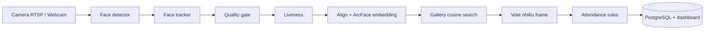

# Attendance Vision Pipeline

## Mục tiêu

Xây dựng hệ thống điểm danh khuôn mặt theo tư duy ESP-WHO nhưng chạy trên VPS GPU: tách từng bước AI, tự động xử lý video, chỉ ghi nhận khi nhận diện ổn định và hợp lệ.

## Luồng chính

## Module AI

| Module | Nhiệm vụ | Model / cách làm MVP | Input | Output |
|---|---|---|---|---|
| Model 1 | Tìm mọi khuôn mặt trong frame | YOLO11n hiện tại; sau eval mới nâng YOLO11s/m | Frame camera | Bounding box, confidence |
| Tracking | Gán cùng một người qua các frame | ByteTrack | Bounding box theo frame | `track_id` ổn định |
| Quality gate | Không cho ảnh xấu vào nhận diện | Blur Laplacian, brightness, face-size, một khuôn mặt | Face crop | Accept/reject + reason |
| Model 2 | Biến mặt thành vector danh tính | ArcFace embedding 512D | Face crop đã align | Embedding L2-normalized |
| Model 3 | Chặn ảnh, màn hình, video giả | Anti-spoof model fine-tune | Face crop / burst frame | `live` / `spoof` + confidence |
| Decision | Tránh điểm danh sai từ một frame | Cosine threshold + vote 3-5 frame cùng `track_id` | Embeddings, liveness | Person / `unknown` / review |

## Đăng ký khuôn mặt

1. Admin nhập `person_id`, lớp/phòng ban.
2. Camera tự hướng dẫn nhìn thẳng, trái, phải, lên, xuống.
3. Chỉ tự chụp frame đạt quality gate và qua liveness.
4. Thu 15-30 ảnh khác nhau; loại ảnh gần trùng hoặc embedding outlier.
5. Lưu 3-10 embedding tốt và một centroid cho mỗi người.
6. Chạy kiểm tra: ảnh cùng người phải pass threshold; ảnh khác người phải thành `unknown`.

Không train lại Model 2 khi có người mới. Chỉ enrollment thêm embedding vào gallery.

## Quy tắc điểm danh

- Chỉ xét khi detector, quality và liveness đều pass.
- Một `track_id` cần ít nhất 3 embedding liên tiếp match cùng `person_id`.
- Nếu cosine dưới threshold: `unknown`, không tự điểm danh.
- Chống trùng: một người chỉ có một sự kiện vào/ra hợp lệ trong cửa sổ thời gian cấu hình.
- API đối chiếu thời gian event với ca làm/lịch học để gán đúng giờ, đi muộn, về sớm hoặc vắng.

## Map phần đã có

| Artifact hiện tại | Vai trò trong pipeline |
|---|---|
| `ml_pipeline/kaggle_detector_kernel/yolo11n_face_detector.ipynb` | Train Model 1 detector |
| `ml_pipeline/kaggle_recognition_kernel/arcface_recognition_finetune.ipynb` | Thay hướng classifier bằng embedding, enrollment và cosine evaluation cho Model 2 |
| `ml_pipeline/kaggle_kernel/face_attendance_data_pipeline.ipynb` | Notebook thử nghiệm/dataset tổng hợp; không dùng làm pipeline production |
| `docs/esp-who-research.md` | Cơ sở tham khảo ESP-WHO |

## Thứ tự triển khai

1. Chạy xong và đánh giá Model 1 bằng WIDER + ảnh camera thật.
2. Tạo notebook Model 2 mới: pretrained ArcFace, crop/align, tạo gallery, enrollment nhiều ảnh, cosine metrics. Không train classifier LFW.
3. Tạo notebook Model 3 liveness và đánh giá `APCER/BPCER`.
4. Viết service inference nhận RTSP/frame, chạy tracker + ba gate + attendance decision.
5. Kết nối database, ca/lịch, dashboard và log audit.

## Tiêu chí nghiệm thu MVP

- Detector: báo cáo mAP50-95 và recall theo face nhỏ, mask, ánh sáng yếu.
- Recognition: `TAR@FAR`, false check-in và unknown rate trên dữ liệu camera giữ riêng.
- Liveness: `APCER`, `BPCER` và tỷ lệ từ chối ảnh/video giả.
- System: p95 latency, số lần điểm danh trùng, số event cần admin review.
