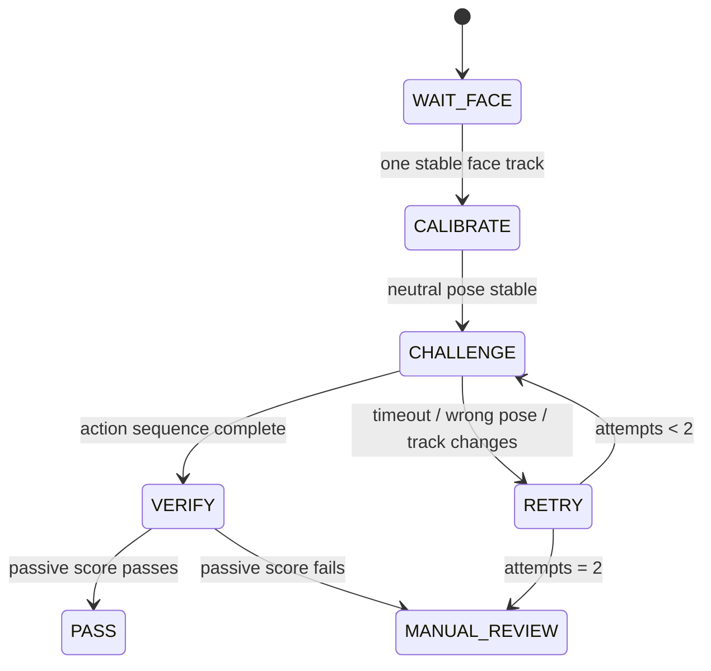

# Model 3 — Active Liveness và Anti-Spoofing

## Quyết định thiết kế

Liveness không phải một classifier duy nhất. Dùng hai điều kiện bắt buộc:

```text
PASS = active challenge passed AND passive anti-spoof score >= calibrated threshold
```

- **Active challenge:** học sinh làm lệnh ngẫu nhiên như quay trái, quay phải và cúi đầu. Phần này dùng landmarks/head pose + state machine, không train classifier hành động.
- **Passive anti-spoof:** model được train/fine-tune để phân loại `live` hoặc `spoof` trên face crop; chặn ảnh in, khuôn mặt cắt rời và video phát lại.

Chỉ quay trái/phải/cúi đầu không đủ an toàn: video replay hoặc deepfake thời gian thực có thể mô phỏng chuyển động. Phải ghép active challenge với passive anti-spoof và tracking liên tục. CelebA-Spoof cũng nhấn mạnh khó khăn về generalization của anti-spoof trong môi trường thực [CelebA-Spoof paper](https://www.ecva.net/papers/eccv_2020/papers_ECCV/papers/123570069.pdf).

## 1. Luồng active challenge



### State machine

| State | Điều kiện và hành động |
|---|---|
| `WAIT_FACE` | Model 1 detect đúng một face, face đủ lớn/rõ và ByteTrack giữ một `track_id`. |
| `CALIBRATE` | Thu 0,5–1 giây pose nhìn thẳng. Lấy median yaw/pitch làm baseline của chính học sinh. |
| `CHALLENGE` | Sinh một nonce và permutation ngẫu nhiên của `LEFT`, `RIGHT`, `DOWN`; hiển thị từng lệnh. |
| `VERIFY` | Mỗi action phải chuyển động từ baseline đến target, giữ target ít nhất 3 frame liên tiếp rồi mới sang action sau. |
| `RETRY` | Sai thứ tự, đổi `track_id`, nhiều mặt, quality/liveness fail hoặc quá thời hạn; tối đa 2 lần. |
| `PASS` | Active sequence pass và passive anti-spoof pass. |
| `MANUAL_REVIEW` | Không điểm danh tự động; ghi lý do để nhân viên xử lý. |

### Ước lượng pose

1. Dùng **MediaPipe Face Landmarker** trên face track để lấy landmarks và facial transformation matrix; API trả landmarks chuẩn hóa cùng transformation matrix [MediaPipe documentation](https://ai.google.dev/edge/api/mediapipe/python/mp/tasks/vision/FaceLandmarkerResult).
2. Từ landmarks/matrix, tính yaw, pitch, roll cho từng frame; dùng delta so với baseline, không dùng góc tuyệt đối vì camera có thể bị nghiêng hoặc mirror.
3. Initial threshold để pilot: `|yaw-neutral| >= 15–25°` cho trái/phải và `|pitch-neutral| >= 10–20°` cho cúi đầu. Dấu yaw/pitch phải được kiểm tra bằng camera thật trước khi khóa config.
4. Mỗi lệnh có thời hạn 2 giây; toàn bộ challenge 6–10 giây. Chỉ nhận nếu đường đi pose liên tục, không phải một frame nhảy thẳng vào target.

`BLINK` là action tùy chọn, không phải điều kiện bắt buộc ở MVP. Khi thêm blink, kiểm tra tín hiệu đóng–mở mắt theo chuỗi frame, không chỉ một ảnh mắt nhắm.

## 2. Passive anti-spoof phải train

### Dataset hiện có

Dataset Kaggle [`tapakah68/anti-spoofing`](https://www.kaggle.com/datasets/tapakah68/anti-spoofing) có 5 cột loại video:

| Nhãn nguồn | Nhãn train |
|---|---|
| `live_selfie`, `live_video` | `live` |
| `cut-out printouts`, `printouts`, `replay` | `spoof` |

EDA metadata CSV ngày 13/08/2026: 9 video ở mỗi cột, tổng **45 video** và subject token quan sát được chỉ **1**. Dataset này đủ để kiểm tra extractor/video pipeline, **không đủ để train hoặc claim generalization**. License Kaggle là `CC BY-NC-ND 4.0`; không dùng artifact/dữ liệu này cho deployment thương mại nếu không có quyền phù hợp.

### Data cần bổ sung

1. Dataset lớn cho nghiên cứu như CelebA-Spoof: 625.537 ảnh, 10.177 subjects, nhiều sensor/ánh sáng/spoof type; chỉ dùng theo license nghiên cứu của dataset [official repository](https://github.com/ZhangYuanhan-AI/CelebA-Spoof).
2. Video có consent từ camera giống camera triển khai: tối thiểu nhiều học sinh/người thật, nhiều buổi, nhiều ánh sáng và nhiều thiết bị.
3. Attack set do đội dự án tự quay: ảnh giấy matte/glossy, cut-out photo, điện thoại/tablet replay, màn hình brightness khác nhau và video người thật quay theo lệnh cũ.
4. Giữ toàn bộ frame của cùng **subject + video + thiết bị** trong đúng một split. Cấm random-split frame vì rò rỉ video gần giống sang validation.

### Cách tạo dữ liệu train

```text
video
→ Model 1 crop một face + margin 25–35%
→ quality gate
→ lấy 3–5 frame/giây, bỏ frame gần trùng
→ label live/spoof và attack_type
→ subject/device-disjoint train/val/test
```

Khởi đầu đơn giản: fine-tune **MobileNetV3-Large pretrained ImageNet** với binary head `live/spoof`, face crop `256 × 256`. Dùng class-weight hoặc balanced sampler nếu số spoof/live lệch; augmentation gồm resize/crop, JPEG compression, blur nhẹ, brightness/contrast và noise. Không augment mạnh đến mức xóa dấu vết print/replay.

Passive score phải là median của 5–8 frame cùng `track_id`, không phải score của một ảnh.

## 3. Rule quyết định

```text
if exactly_one_stable_track
   and face_quality_pass
   and active_sequence_pass
   and median(passive_live_score) >= threshold:
       liveness = PASS
else:
       liveness = RETRY or MANUAL_REVIEW
```

- Threshold passive chọn trên validation set theo chi phí sai: spoof pass là lỗi nghiêm trọng hơn live bị retry.
- Không dùng threshold mặc định `0.5` trong production.
- Lưu event audit tối thiểu: model version, passive score, active action timeline, reason pass/fail. Không cần lưu video thô mặc định.

## 4. Metric và nghiệm thu

| Metric | Mục tiêu |
|---|---|
| APCER | Tỷ lệ attack bị nhận nhầm là live; cần giảm thấp nhất. |
| BPCER | Tỷ lệ người thật bị từ chối. |
| ACER | Trung bình APCER và BPCER; chỉ dùng khi hai lỗi có chi phí tương đương. |
| Challenge completion rate | Tỷ lệ học sinh pass active challenge ngay lần đầu. |
| End-to-end latency | Từ face stable đến PASS/RETRY. |

Test set phải có attack chưa thấy theo video/device và báo cáo riêng từng loại: print, cut-out, replay. Benchmark surveillance PAD nhấn mạnh đánh giá robustness dưới thay đổi chất lượng/giám sát thay vì chỉ accuracy ảnh đơn [CVPRW 2023](https://openaccess.thecvf.com/content/CVPR2023W/FAS/html/Escalera_Surveillance_Face_Presentation_Attack_Detection_Challenge_CVPRW_2023_paper.html).

## 5. Thứ tự thực hiện

1. Tạo module `pose_challenge`: landmark, calibration, state machine, event log; chưa cần train.
2. Tạo notebook EDA cho video anti-spoof: số video, subject, device, attack type, FPS, duration, frame quality.
3. Chuẩn bị data splitter subject/video/device-disjoint và frame extractor từ `face_best.pt`.
4. Train Model 3 passive anti-spoof, chọn threshold theo APCER/BPCER.
5. Ghép active + passive + detector/tracker; chỉ khi cả hai pass mới gọi Model 2 recognition và attendance rule.

## 6. Điều kiện an toàn và UX

- Sequence phải random mỗi lần; không cố định trái → phải → cúi.
- Có phương án fallback có giám sát cho học sinh không thể thực hiện một chuyển động; không tự đánh dấu vắng.
- Face liveness không bảo đảm chống được mọi deepfake/replay thời gian thực. Với điểm danh có hậu quả cao, dùng thêm camera IR/depth hoặc giám sát người thật.
- Thu thập video/attack data cần consent, quyền truy cập tối thiểu, retention ngắn và không đưa ảnh sinh trắc học lên public dataset.
